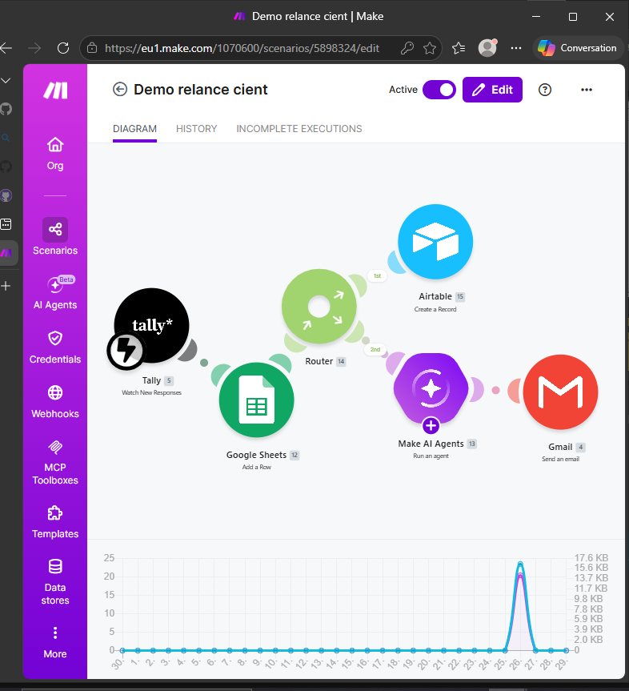

# Lead-Converison-Engine
Système d'automatisation de leads et CRM personnalisé pour designers.

# 📈 Lead Conversion Engine : Automatisation du Pipeline Client

## 🎯 Objectif du Projet
Transformer un processus de capture de leads manuel et désorganisé en un système automatisé de conversion, permettant à un professionnel du Design de se concentrer sur la création plutôt que sur l'administration.

---

## ❌ Le Problème (Avant)
Le client faisait face à plusieurs points de friction qui freinaient sa croissance :
- **Saisie manuelle :** Les prospects s'enregistraient, mais les données devaient être copiées à la main dans un tableau.
- **Réponse lente :** Le délai entre l'inscription et le premier contact était trop long, faisant perdre l'intérêt du prospect.
- **Emails génériques :** L'absence de personnalisation réduisait le taux de réponse.
- **Oublis de relance :** Sans système de rappel, beaucoup de prospects potentiels n'étaient jamais relancés.
 
---

## ✅ La Solution (Après)
Mise en place d'un écosystème interconnecté qui gère le cycle de vie du prospect de A à Z.

### ⚙️ Le Workflow d'Automatisation
Le système suit un flux logique et automatisé :

1. **Capture & Qualification :** 
   - Le prospect remplit un formulaire.
   - Les données sont instantanément envoyées vers une base de données centralisée.
   
2. **Engagement Immédiat (Welcome Sequence) :**
   - Déclenchement d'un email de bienvenue **personnalisé**. 
   - *Exemple :* Si le prospect a besoin d'un "Logo", l'email mentionne spécifiquement l'expertise du designer en branding.

3. **Système de Relance Intelligent :**
   - Si aucune réponse n'est reçue après X jours, le système envoie automatiquement un email de relance courtois et stratégique.
   - Ce processus s'arrête dès que le prospect répond ou change de statut.

4. **Pilotage via CRM Personnalisé :**
   - Création d'un tableau de bord (CRM) où chaque prospect est suivi via un pipeline visuel :
     `Prospect` ➔ `En discussion` ➔ `À relancer` ➔ `Client Confirmé`.

---

## 🛠️ Stack Technique
- **Capture :** [Tally]
- **Automatisation :** [Make.com ]
- **Base de données & CRM :** [Airtable / Google Sheet]
- **Communication :** [Gmail]

---

## 🚀 Impact & Résultats
| Indicateur | Avant l'automatisation | Après l'automatisation |
| :--- | :--- | :--- |
| **Temps de saisie** | 15-30 min par prospect | **0 minute (Instantané)** |
| **Délai de réponse** | Plusieurs heures / jours | **Quelques secondes** |
| **Taux de relance** | Aléatoire (oublis fréquents) | **100% des prospects relancés** |
| **Organisation** | Éparpillée (emails, notes) | **Centralisée dans un CRM unique** |

---

## 🖼️ Aperçu du Workflow

''
---

## 📩 Vous voulez un système similaire ?
Si vous perdez du temps avec des tâches répétitives et que vous souhaitez optimiser votre acquisition client, contactez-moi :
- **Email :** [efficiencypot@gmail.com]

 
